# Projectile Solver

## Hitting a moving target with a ballistic projectile

The games I play come with simple ballistic physics for projectile-based weapons: the projectiles are fired with an initial speed and are only affected by gravity. The resulting trajectory is a ballistic trajectory.

Because gravity is a harsh mistress literally every game 'cheats' this and fakes a much lower gravity constant for projectiles than is used for players. Without this hack projectiles are either pathethic or need a very high velocity to compensate.

In this article I present a method of calculating where to aim your weapon which fires a projectile under simple gravity to hit an arbitrary moving target in 3D space. For a video of the result, scroll down to the bottom.

Before we tackle this problem let's consider a more simple example: hitting a stationary target. Let's simplify even further to only consider the 2D case:

Consider the location from which the projectile is fired at `[0, 0]` and we're trying to hit a target at `[x, y]`. As luck would have it [wikipedia's Projectile motion article](https://en.wikipedia.org/wiki/Projectile_motion#Angle_%7F'%22%60UNIQ--postMath-0000003A-QINU%60%22'%7F_required_to_hit_coordinate_\(x,y\)) has the formula for calculating the angle to shoot at:


An interesting feature is that this equation has either zero, one or two solutions. Intuitively these correspond with whether the projectile has enough speed to even reach the target and if it's too fast we can either shoot directly at the target or lob it up high and hit it on the way back down.

How do we know which of the two solutions to pick? First if the value under the square root is negative then there are no solutions, the target is too far away. Then the final value is put under `atan` to get the angle. The larger the slope value given to `atan` is, the closer the angle is to 90°. A lower slope results in a lower angle (assuming all positive values). Thus the lower slope is the optimal angle and the higher slope lobs the projectile up high.

Finally we can calculate the time the projectile takes to reach the target. This is independent of gravity and is simply derived from the horizontal distance.

```rust
fn optimal_angle(x: f32, y: f32, v0: f32, g: f32) -> Option<f32> {
	let root = v0 * v0 * v0 * v0 - g * (g * x * x + 2.0 * y * v0 * v0);
	if root < 0.0 {
		return None;
	}
	let root = f32::sqrt(root);
	let angle = f32::atan((v0 * v0 - root) / (g * x));
	Some(angle)
}

fn lob_angle(x: f32, y: f32, v0: f32, g: f32) -> Option<f32> {
	let root = v0 * v0 * v0 * v0 - g * (g * x * x + 2.0 * y * v0 * v0);
	if root < 0.0 {
		return None;
	}
	let root = f32::sqrt(root);
	let angle = f32::atan((v0 * v0 + root) / (g * x));
	Some(angle)
}

fn travel_time(x: f32, angle: f32, v0: f32) -> f32 {
	x / (f32::cos(angle) * v0)
}
```

Everything is better with visualizations! Here's the result of the formulas:


Legend:
* The projectile is fired with `v0 = 650 u/s`, `g = 400 u/s²`.
* Green is the target at position `[650, 150]`.
* Blue is the optimal path aimed at `34.27°` and reaches the target in `1.21 s`.
* Red lobs the projectile at `68.73°` and reaches the target in `2.76 s`.

So far so good, we can hit stationary target in 2D. In fact, this also solves the problem of hitting a stationary target in 3D with a clever framing of the problem:

In this simplified world where projectiles are only affected by gravity, consider the vertical plane passing through the player and the target. The projectile fired by the player travels in this plane! Thus we can construct a 2D setup which when solved results in an angle aimed at the target and pitched with the resulting angle from the 2D solution.

(still working on 3D animations!)

So how do we hit a moving target? If we aimed at the target as if he stood still, when the projectile reaches the target at t<sub>hit</sub>. However at this point the target would have moved some distance away. Now let t<sub>guess</sub> start at `0 s` and increment in steps of, say, `0.01 s`. Predict the target's position at t<sub>guess</sub> and fire a projectile at this position. Compare the projectile's travel time t<sub>hit</sub> with our chosen t<sub>guess</sub>. Initially t<sub>guess</sub> is less than t<sub>hit</sub> but as t<sub>guess</sub> increases these values converge (or not in case the target is not reachable). When t<sub>guess</sub> first gets larger (but still close to) t<sub>hit</sub> we have a fairly accurate estimation of when and where a projectile, when fired at this position, will hit the target.

All of this hinges on a good prediction of the target. In the following demo I will use simple linear extrapolation, but quadratic extrapolation to simulate gravity works just as well. This is a very crude approximation of the future and gets less reliable the further in the future is predicted. We can put an arbitrary cap where the accuracy of this extrapolation becomes too inaccurate. For the purpose of this demo it doesn't matter as we'll make the target move predictably.

The algorithm in code:

```rust
struct Target {
	position: [f32; 2],
	velocity: [f32; 2],
	gravity: f32,
}
impl Target {
	fn predict(&self, time: f32) -> [f32; 2] {
		let x = self.position[0] + self.velocity[0] * time;
		let y = self.position[1] + self.velocity[1] * time - self.gravity * time * time * 0.5;
		[x, y]
	}
}

struct Weapon {
	speed: f32,
	gravity: f32,
}

const MAX_TIME: f32 = 5.5;
const TIME_STEP: f32 = 0.01;

struct Solver {
	target: Target,
	weapon: Weapon,
}
impl Solver {
	fn solve(&self) -> Option<f32> {
		let mut target_time = 0.0;
		while target_time < MAX_TIME {
			let target_pos = self.target.predict(target_time);
			let sol_angle = self.angle(target_pos)?;
			let sol_time = travel_time(target_pos[0], sol_angle, self.weapon.speed);
			if sol_time < target_time {
				return Some(sol_angle);
			}
			target_time += TIME_STEP;
		}
		None
	}
	fn angle(&self, pos: [f32; 2]) -> Option<f32> {
		optimal_angle(pos[0], pos[1], self.weapon.speed, self.weapon.gravity)
	}
}
```

And visualized:


Legend:
* The projectile is fired with `v0 = 600 u/s`, `g = 400 u/s²`.
* Green is the target at position `[450, 0]` and is moving with velocity `[100, 50]` in a linear path.
* Blue is the optimal path aimed at `24.96°` and reaches the target in `1.01 s`.
* Red lobs the projectile at `61.17°` and reaches the target in `2.38 s`.

The above animation shows the solver in 2D action but is trivially extended to 3D. Plug in an appropriate target position predictor and construct the 2D setup before solving.

Just to show that the target predictor isn't restricted to linear trajectory, in the following animation the target is making a circular motion and the solver has no issues hitting the target:



If you're interested in reading more about this topic the following articles may be of interest:

* https://www.forrestthewoods.com/blog/solving_ballistic_trajectories/

  This person tries to analytically solve the movements of the projectile and the target moving in a linear motion. For my purposes it is important that the target predictor can be chosen freely and thus his analytic solution does not apply here.

* https://www.hindawi.com/journals/ijcgt/2014/463489/

  This article is more advanced as it incorporates linear drag into the solver as well as solves for more than just the angle to shoot at to hit the target. The article only tries to hit stationary targets but briefly hints at an iterative approach to use the same solution to hit a moving target. It is that solution that I present here. Plug in his solutions for hitting a stationary target with fixed initial speed projectile and now you can hit moving targets in 3D!

The animations were made with custom code and rendering to svg with [format_xml](https://github.com/CasualX/format_xml). My personal goal with this article is to experiment with quickly and simply visualizing algorithms and using Rust + SVG as my canvas.

This isn't something new, but I wanted to write this down for future reference. Years ago I made a video demonstrating the results of my efforts in [Team Fortress 2](https://en.wikipedia.org/wiki/Team_Fortress_2):

[](https://www.youtube.com/watch?v=MHZ35b_q_Gc)

Thanks for reading!
